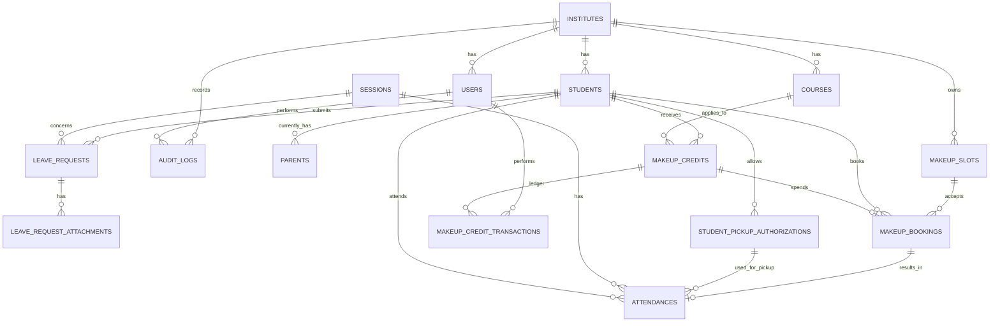

# ER Project: Schema ปัจจุบันเทียบกับ SRS

> ตรวจจาก `process.md`, `ProjectObj.md`, CSV schema ล่าสุด `results-2026-09-12-220648.csv` และโมเดล/DbContext ที่พบใน `API`
>
> **ขอบเขตสำคัญ:** เอกสารนี้แยกสิ่งที่ยืนยันได้จากไฟล์ที่ตรวจ (`Verified`) ออกจากโครงสร้างที่เสนอให้เพิ่ม (`Proposed`) ไม่ใช่ผลจากการต่อฐานข้อมูล runtime และไม่ยืนยันว่าข้อมูล production มีค่าเหมือน CSV ทุกแถว

## วิธีอ่านเอกสาร

- **Verified:** พบชื่อตาราง/คอลัมน์/ความสัมพันธ์ใน CSV ล่าสุด
- **Code evidence:** พบ model/configuration/endpoint ใน `API` แต่ยังไม่ใช่หลักฐานว่า runtime flow ผ่าน SRS
- **Not verified:** ไม่พบหลักฐานในไฟล์ที่ตรวจ ไม่ได้แปลว่าไม่มีอยู่ใน production แน่นอน
- **Proposed:** แบบออกแบบสำหรับพิจารณา ยังไม่ใช่ schema ปัจจุบัน
- **Business rule:** กฎการทำงานที่เอกสารต้องการ ไม่ใช่หลักฐานว่าระบบทำงานครบแล้ว

## 1. สิ่งที่ยืนยันได้จากหลักฐาน

จาก CSV ล่าสุดและ SRS พบข้อเท็จจริงเชิงโครงสร้างดังนี้:

1. CSV ล่าสุดมี `makeup_bookings`, `makeup_credit_transactions`, `audit_logs` และ `student_pickup_authorizations` แล้ว
2. CSV ล่าสุดมี `attendances.pickup_authorization_id`, `updated_at`, `updated_by` และ FK ที่เกี่ยวข้องแล้ว
3. CSV ล่าสุดมี `makeup_credits.status`, `used_at`, `expired_at` แล้ว
4. CSV ล่าสุดมี `makeup_slots.institute_id` และ FK ไป `institutes`; ยังไม่มี `course_id` หรือ `status`
5. CSV ล่าสุดมี unique constraint `uq_attendance_session_student`
6. ตารางที่มีอยู่จริงไม่ยืนยันว่า SRS flow ทำงานครบ เช่น atomic approval, booking concurrency, group cancel, no-show, audit event และ LIFF UI

รายการข้างต้นเป็นผลจากหลักฐานที่ตรวจ ไม่ใช่ข้อสรุปว่า production ไม่มีข้อมูลเหล่านี้ เพราะ CSV/schema runtime อาจเปลี่ยนหลังวันที่ตรวจ

## 2. ตารางที่พบใน schema

### Verified: พบใน CSV ล่าสุด

- `institutes`, `users`, `teachers`
- `students`, `parents`
- `courses`, `enrollments`, `sessions`, `attendances`
- `leave_requests`, `makeup_credits`, `makeup_slots`
- `makeup_bookings`, `makeup_credit_transactions`, `audit_logs`
- `student_pickup_authorizations`
- `payments`, `notifications`
- `room_bookings`, `pdpa_consents`, `public_website_contents`
- `homeworks`, `homework_submissions`
- `skill_topics`, `skill_scores`, `badges`, `student_badges`, `streak_counters`

### ยังไม่พบใน schema ล่าสุด / ไม่ใช่ blocker ที่ SRS ระบุชัด

| รายการ | หลักฐานที่พบ | สถานะจากขอบเขตนี้ |
|---:|---|---|
| `makeup_slots.course_id` | ไม่พบใน CSV ล่าสุด | Not verified; SRS ไม่ได้ระบุเป็น field บังคับของ slot |
| `makeup_slots.status` | ไม่พบใน CSV ล่าสุด | Not verified; ต้องตัดสินใจจาก business rule ก่อนเพิ่ม |
| `holidays` | ไม่พบใน CSV | Not verified |
| `file_assets` | ไม่พบใน CSV | Not verified |

### Verified schema: `leave_request_attachments`

CSV ใหม่ยืนยันตารางนี้แล้ว ใช้เก็บใบรับรองแพทย์/ไฟล์ประกอบคำลาแบบหลายไฟล์ต่อคำขอ:

| คอลัมน์ | หน้าที่ | สถานะ |
|---|---|---|
| `id` | primary key | Verified |
| `institute_id` | tenant isolation | Verified |
| `leave_request_id` | FK ไป `leave_requests.id` | Verified |
| `storage_url` | URL สำหรับเปิดไฟล์ | Verified |
| `object_key` | key สำหรับลบ/จัดการ object storage | Verified |
| `original_file_name` | ชื่อไฟล์ที่ผู้ใช้ส่ง | Verified |
| `content_type` | MIME type ที่ตรวจแล้ว | Verified |
| `file_size_bytes` | ขนาดไฟล์ | Verified |
| `uploaded_by` | user ที่ upload | Verified |
| `created_at` | เวลาที่ upload | Verified |

ไม่เพิ่ม `attachment_url` ใน `leave_requests` เพราะหนึ่งคำขออาจมีหลายไฟล์ และการแยก table ทำให้ ownership, tenant, delete และ metadata ตรวจสอบได้ชัดกว่า

## 3. ER ปัจจุบันและความสัมพันธ์ตาม SRS

> Mermaid ด้านล่างรวมความสัมพันธ์ที่ยืนยันจาก FK ใน CSV ล่าสุดกับความสัมพันธ์เชิงธุรกิจตาม SRS ความสัมพันธ์เชิงธุรกิจบางรายการอาจไม่มี FK ตรงในฐานข้อมูล

> หมายเหตุ: ความสัมพันธ์ `MAKEUP_BOOKINGS ||--o| ATTENDANCES` เป็นเชิงธุรกิจ ไม่จำเป็นต้องบังคับด้วย FK ตรงๆ ถ้าระบบยังใช้ `sessions` เป็นแกนของ attendance อยู่ ควรเก็บ `attendance_id` ใน booking หรือเก็บ `session_id` ใน slot ให้ชัดเจนอย่างใดอย่างหนึ่ง

## 4. Schema ที่มีอยู่จริงเทียบกับ SRS gap

> ตารางและคอลัมน์ที่ระบุในหัวข้อนี้มาจาก CSV ล่าสุดแล้ว ส่วนรายการ SRS gap เป็นสิ่งที่ต้องตรวจจาก service, endpoint, UI, worker และข้อมูล runtime ต่อ ไม่ใช่ข้อสรุปจากการมีตารางเพียงอย่างเดียว

### 4.1 `makeup_bookings` (Verified schema; SRS gap)

CSV ล่าสุดยืนยันว่ามีตารางนี้และมี FK/unique key สำหรับ slot, student และ credit แล้ว

| คอลัมน์ | ชนิดแนะนำ | กติกา |
|---|---|---|
| `id` | `bigint` | PK |
| `institute_id` | `int` | NOT NULL, FK `institutes.id` |
| `slot_id` | `int` | NOT NULL, FK `makeup_slots.id` |
| `student_id` | `int` | NOT NULL, FK `students.id` |
| `credit_id` | `bigint` | NOT NULL, FK `makeup_credits.id` |
| `status` | `varchar(20)` | `booked`, `cancelled`, `attended`, `no_show` |
| `booked_at` | `datetime` | NOT NULL |
| `cancelled_at` | `datetime` | NULL |
| `cancel_reason` | `varchar(255)` | NULL |
| `checked_in_at` | `datetime` | NULL |
| `created_by` | `int` | NULL, FK `users.id` |
| `updated_at` | `datetime` | NOT NULL |

**Constraint/index ที่เสนอ**

- Unique `(slot_id, student_id)` เฉพาะรายการที่ยัง active ถ้า DB รองรับ filtered index; ถ้าไม่รองรับ ให้บังคับซ้ำใน transaction/API ด้วย
- Unique `(credit_id)` สำหรับ booking ที่ active เพื่อไม่ให้เครดิต 1 ใบถูกใช้สองครั้ง
- Index `(institute_id, slot_id, status)`
- Index `(student_id, status)`
- ตอนจองต้อง lock slot/credit ใน transaction แล้วตรวจ `booked_count < capacity`

### 4.2 `makeup_credit_transactions` (Verified schema; SRS gap)

CSV ล่าสุดยืนยันว่ามี ledger นี้แล้ว แต่ยังต้องตรวจว่าทุกการ grant/reserve/consume/release/expire ถูกเขียนจริงตาม SRS หรือไม่

| คอลัมน์ | ชนิดแนะนำ | กติกา |
|---|---|---|
| `id` | `bigint` | PK |
| `institute_id` | `int` | NOT NULL |
| `credit_id` | `bigint` | NOT NULL, FK `makeup_credits.id` |
| `student_id` | `int` | NOT NULL |
| `transaction_type` | `varchar(30)` | `grant`, `reserve`, `consume`, `release`, `expire`, `adjust` |
| `amount` | `smallint` | ปกติใช้ 1 หรือ -1 ตาม convention ที่เลือก |
| `reference_type` | `varchar(50)` | เช่น `leave_request`, `makeup_booking`, `session` |
| `reference_id` | `bigint` | NULL ได้ถ้าเป็น adjustment |
| `note` | `varchar(500)` | NULL |
| `created_by` | `int` | NULL |
| `created_at` | `datetime` | NOT NULL |

แนะนำให้ `makeup_credits` เป็นสิทธิ์/หน่วยเครดิตต้นทางหนึ่งใบ และให้ ledger เป็นประวัติการเคลื่อนไหว ไม่ควรเก็บยอดคงเหลือซ้ำหลายจุดจนข้อมูลไม่ตรงกัน

### 4.3 `audit_logs` (Verified schema; SRS gap)

CSV ล่าสุดยืนยันว่ามีตาราง audit event และคอลัมน์ตามด้านล่าง แต่ยังไม่ยืนยันว่ามี event login/logout และการแก้ข้อมูลสำคัญครบตาม SRS:

| คอลัมน์ | ชนิดแนะนำ |
|---|---|
| `id` | `bigint` PK |
| `institute_id` | `int` NOT NULL |
| `user_id` | `int` NULL |
| `action` | `varchar(50)` NOT NULL เช่น `create`, `update`, `delete`, `login` |
| `entity_type` | `varchar(100)` NOT NULL |
| `entity_id` | `varchar(100)` NULL |
| `before_json` | `json` NULL |
| `after_json` | `json` NULL |
| `ip_address` | `varchar(45)` NULL |
| `user_agent` | `varchar(500)` NULL |
| `created_at` | `datetime` NOT NULL |

Index `(institute_id, created_at)`, `(entity_type, entity_id)`, `(user_id, created_at)`

### 4.4 `student_pickup_authorizations` (Verified schema; SRS gap)

CSV ล่าสุดยืนยันว่ามีตารางนี้และมี FK ไปยังนักเรียน/สถาบัน/ผู้สร้างแล้ว

| คอลัมน์ | ชนิดแนะนำ |
|---|---|
| `id` | `bigint` PK |
| `institute_id` | `int` NOT NULL |
| `student_id` | `int` NOT NULL |
| `full_name` | `varchar(255)` NOT NULL |
| `phone` | `varchar(50)` NULL |
| `relationship` | `varchar(100)` NULL |
| `id_card_last4` | `varchar(4)` NULL |
| `photo_url` | `varchar(1000)` NULL |
| `is_active` | `boolean` NOT NULL |
| `valid_from` | `date` NULL |
| `valid_until` | `date` NULL |
| `created_by` | `int` NULL |
| `created_at` | `datetime` NOT NULL |
| `revoked_at` | `datetime` NULL |

จากนั้นปรับ `attendances.picked_up_by` ให้เก็บชื่อ snapshot เพื่อแสดงย้อนหลัง และเพิ่ม `pickup_authorization_id` เป็น FK nullable เพื่อรู้ว่าอ้างอิงสิทธิ์ใบไหน

## 5. ตารางเดิม: สิ่งที่พบและข้อเสนอแก้ไข

> รายการในหัวข้อนี้แบ่งเป็น `Verified current shape` และ `Proposed change` เพื่อไม่ให้สับสนระหว่าง schema ปัจจุบันกับแบบที่อยากให้เป็น

### `makeup_slots`

**Verified current shape:** CSV มี `teacher_id`, `scheduled_at`, `capacity`, `booked_count` และ `room_id` ใน `makeup_slots` แต่ไม่พบ `institute_id` หรือ `course_id`

**Proposed change:**

- `institute_id` NOT NULL, FK `institutes.id`
- `course_id` NOT NULL, FK `courses.id`
- `status` เช่น `open`, `full`, `cancelled`, `completed`
- `cancelled_at`, `cancelled_by`, `cancel_reason`
- `created_at`, `created_by`, `updated_at`
- ถ้าจะใช้ attendance flow เดิม ให้เพิ่ม `session_id` nullable หรือสร้าง session ให้ slot ทุกครั้ง อย่าปล่อยให้ slot ลอยโดยไม่มีแกนของการเข้าเรียน

`booked_count` มีอยู่จริงใน CSV ส่วนการกำหนดให้เป็น cache หรือ source of truth ยังเป็น business/application design decision ไม่ใช่ข้อเท็จจริงจาก schema

### `leave_requests`

**Verified current shape:** ใน CSV `leave_requests` ไม่พบคอลัมน์ไฟล์แนบ

**Proposed change:**

- `attachment_url` หรือดีกว่า `attachment_id` FK ไป `file_assets`
- `requested_by_user_id`
- `approved_at`, `rejected_at`, `rejection_reason`
- `makeup_credit_id` nullable เพื่อ trace ว่าการอนุมัติครั้งนี้สร้างเครดิตใบไหน

### `makeup_credits`

**Verified current shape:** CSV มี `used_session_id` แต่ไม่พบ status lifecycle หรือ booking reference ที่ระบุในแบบร่างนี้

**Proposed change:**

- `status`: `available`, `reserved`, `used`, `released`, `expired`, `cancelled`
- `source_leave_request_id` FK nullable
- `reserved_booking_id` FK nullable หรือให้ trace ผ่าน ledger อย่างเดียว
- `used_at`, `expired_at`

ถ้าเพิ่ม `makeup_credit_transactions` แล้ว ให้เลิกใช้ `used_session_id` เป็นตัวตัดสินสถานะหลัก และเก็บไว้เพื่อ compatibility ชั่วคราวก่อนลบใน migration ภายหลัง

### `parents`

ของเดิมผูก `parent -> student` โดยตรง จึงรองรับหลายผู้ปกครองต่อเด็กได้ แต่ผู้ปกครองคนเดียวกันกับพี่น้องหลายคนต้องสร้างซ้ำ

- ระยะสั้น: ใช้ต่อได้ ยังไม่ต้องรื้อ
- ระยะยาว: แยก `guardians` และ `student_guardians(student_id, guardian_id, relationship, is_primary, is_active)`
- อย่ารีบทำเรื่องนี้ก่อนระบบ make-up เพราะเป็น refactor ใหญ่และไม่ใช่ blocker ของ P0

### `attendances`

**Proposed change / verification needed:**

- Unique `(session_id, student_id)` ป้องกันเช็คชื่อซ้ำ
- `pickup_authorization_id` nullable
- `updated_at`, `updated_by` ถ้าต้องการ audit การแก้สถานะย้อนหลัง
- FK ให้ครบกับ `sessions`, `students`, `institutes`

### `notifications`

ตอนนี้มีทั้ง `user_id` และ `recipient_id` ซึ่งความหมายทับกันได้ ให้กำหนดให้ชัด:

- `user_id` = ผู้ใช้ภายในระบบที่เป็นเจ้าของ/ผู้สร้างรายการ ถ้าจำเป็น
- `recipient_id` = external recipient เช่น LINE user id
- เพิ่ม `entity_type`, `entity_id` เพื่อ trace ว่าแจ้งเตือนเพราะ attendance/payment/leave รายการไหน

## 6. ข้อควรระวังในการออกแบบ (Proposed guidance)

- ไม่สร้าง `makeup_slots_new` หรือ `makeup_credits_new` แล้วปล่อยของเก่าค้างโดยไม่มีแผนย้าย
- ไม่ใช้ `booked_count` เป็นหลักฐานการจอง
- ไม่ใช้ comma-separated text เก็บรายชื่อผู้รับเด็กหรือหลายไฟล์
- ไม่เพิ่มตาราง `audit_logs` โดยไม่มี retention และสิทธิ์การดู เพราะ log เองมีข้อมูลส่วนบุคคล
- ไม่ทำ `holidays`, `file_assets`, referral และ analytics ก่อนปิด flow ลา/เครดิต/จองให้ครบ

## 7. สถานะหลัง schema ล่าสุดเทียบกับ SRS

### Schema change ที่มีหลักฐานแล้ว

- `makeup_slots.institute_id` และ FK มีอยู่ใน CSV ล่าสุด
- unique `(session_id, student_id)` ของ `attendances` มีอยู่ใน CSV ล่าสุด
- `makeup_credits.status`, `used_at`, `expired_at` มีอยู่ใน CSV ล่าสุด
- `makeup_bookings`, `makeup_credit_transactions`, `audit_logs` และ `student_pickup_authorizations` มีอยู่ใน CSV ล่าสุด
- `attendances` มี FK ไปยัง `student_pickup_authorizations` และ `users` แล้ว

### SRS gap ที่ยังต้องพิสูจน์จากโค้ดและ runtime

- approve leave → สร้าง credit ใน transaction เดียวกัน
- reserve slot + reserve credit ต้องป้องกัน concurrent overbooking
- group cancel ต้องคืนเครดิตตาม SRS
- no-show ต้องหักเครดิตและไม่คืนเครดิตตาม FR-LV-09
- audit event ต้องเกิดเมื่อ login/logout และแก้ข้อมูลสำคัญ
- LIFF ต้องแจ้งลา ดู slot และจอง slot ได้จริง
- check-out ต้องตรวจสิทธิ์ผู้รับเด็กและส่ง notification ตาม SRS

## 8. เงื่อนไขตรวจรับที่เสนอสำหรับ Make-up MVP

ถือว่าฐานข้อมูลพร้อมสำหรับ Make-up MVP เมื่อทำได้ครบ:

- นักเรียน 1 คนจอง slot เดิมซ้ำไม่ได้
- เครดิต 1 ใบถูกใช้กับ booking active ได้ไม่เกิน 1 รายการ
- slot เต็มแล้วจองเพิ่มไม่ได้ แม้มี request พร้อมกันหลายรายการ
- ยกเลิก slot แล้วคืนเครดิตให้ทุก booking ที่ active
- no-show กับ cancel ให้ผลต่อเครดิตคนละแบบตาม business rule
- ทุกการเปลี่ยน leave/credit/booking มี audit trail
- query ทุกตารางใหม่ถูกกรองด้วย `institute_id`
- เช็คชื่อซ้ำ `(session_id, student_id)` ไม่ได้

## 9. สรุปจากหลักฐานและ SRS

จาก CSV ล่าสุด schema รองรับ flow สำคัญของ SRS แล้ว แต่ยังสรุปไม่ได้ว่า implementation ผ่านครบ เพราะ schema ไม่พิสูจน์ service, endpoint, UI, worker, notification และ transaction:

1. ไม่ต้องสร้างตาราง 4 กลุ่มนี้ซ้ำ
2. ตรวจข้อมูล orphan, tenant mismatch, capacity และ active booking ซ้ำ
3. ตรวจ SRS flow ที่ยังขาดจาก service/API/UI/runtime
4. เพิ่มเฉพาะ schema ที่มี requirement และหลักฐานรองรับ เช่น attachment ของ leave หาก SRS implementation ต้องใช้จริง
